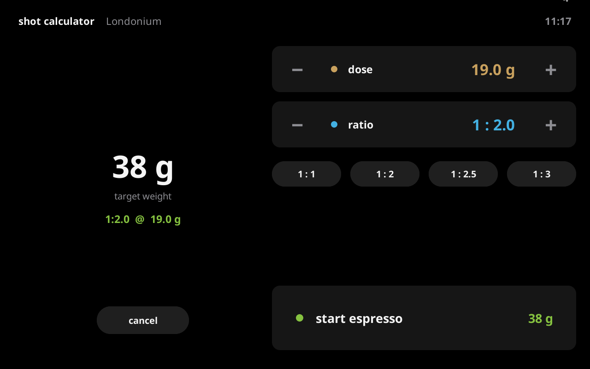
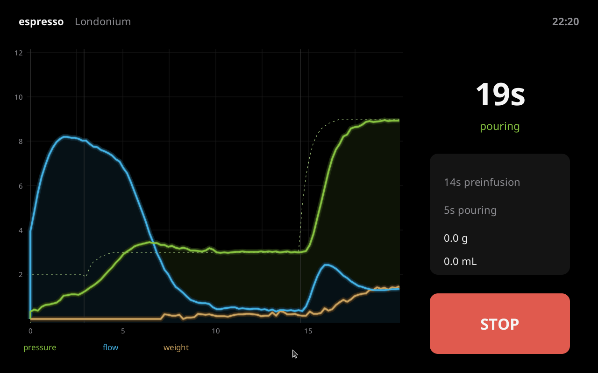
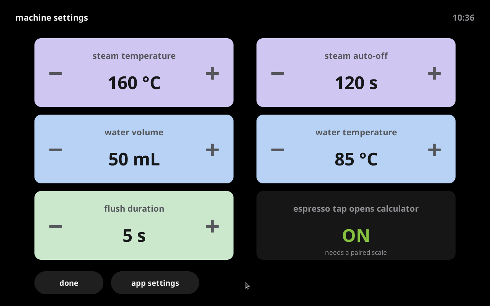

# SWDark5

A premium dark skin for the [Decent Espresso DE1](https://decentespresso.com) tablet app —
the successor to [SWDark4](https://github.com/decentespresso/de1app/tree/main/de1plus/skins/SWDark4)
by Spencer Webb.



## Design — "Shot Deck"

- **The shot is the hero.** Your last shot stays on the home screen as a glowing
  chart — pressure (green), flow (blue) and weight (gold), with soft glow and
  translucent area fills, all on pure black.
- **Vector-drawn.** No per-resolution background bitmaps; every panel, chip and
  dot is drawn on the canvas, so it scales to any screen.
- **Action chips.** Espresso, steam, water and flush are dark chips with
  colour-coded live values. Tap to start.
- **SWDark heritage.** The signature `#86C240` green / `#43B1E3` blue palette,
  charts-always-visible layout, and the SWDark4 shot calculator, rebuilt.



## Shot calculator

Dose × ratio = target weight, synced two-way with the app's stop-at-weight
(standard and advanced profiles). Adjust with big edge tap zones (outer ±1,
inner ±0.1), ratio presets, and start the shot right from the calculator.


- Tap the green **dose · ratio · target** chip on the home screen to open it.
- With *espresso tap opens calculator* enabled (machine settings) **and a scale
  paired**, tapping **espresso** opens it too — same behaviour as SWDark4.
- Settings persist in `userdata/` and are seeded from SWDark4's userdata on
  first run, so existing tuning carries over.

## Machine settings

Steam temperature and auto-off, water volume and temperature, flush duration,
and the calculator toggle — as adjuster cards. The **app settings** pill drops
into the standard de1app settings for everything else.



## Install

1. Copy this folder to `de1plus/skins/SWDark5/` on your tablet.
2. Choose **SWDark5** in the app's skin settings.

## Desktop development (no machine needed)

Run de1app on a desktop with [undroidwish](https://www.androwish.org/):
clone [de1app](https://github.com/decentespresso/de1app) with submodules,
symlink this folder into `de1plus/skins/`, and start the app — without
Bluetooth it simulates the machine, including espresso shots.

On Linux, undroidwish's bundled BlueZ `ble` package makes de1app misdetect the
platform as Android and crash on the missing `borg` command; block
`package require ble` before sourcing `de1plus.tcl` to run in simulation mode.

## Layout

```
SWDark5/
├── skin.tcl                entry point (sourced by de1app)
├── theme.tcl               palette + chart colours (::swdark5 array)
├── framework.tcl           swd5_* helpers: panels, chips, pills, dots,
│                           glow shot graph, colour blending, z-order fix
├── calculator.tcl          dose x ratio engine (SWDark4 port)
├── pages/
│   ├── home.tcl            "Shot Deck" home page
│   ├── calc_page.tcl       shot calculator
│   ├── settings_page.tcl   machine settings
│   ├── live.tcl            espresso / steam / water / flush pages
│   └── system.tcl          screensaver wake-up
└── userdata/               per-user skin settings (created on first run)
```

## Credits

- Design and original SWDark skins: Spencer Webb
- Built on the [Decent Espresso de1app](https://github.com/decentespresso/de1app) skin API
- Layout inspiration: SWDark4's data density and the clean big-numeral look of
  modern espresso machine apps
